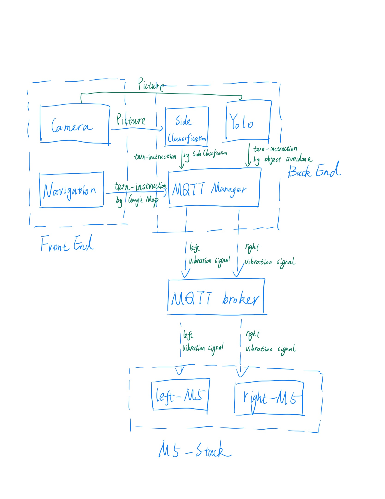

# Report

## 1. Introduction

## 2. Architecture and Implementation

### 2.1 Overall Architecture

The system takes navigation destination and camera image as input, and outputs the turn-by-turn navigation instruction in the form of M5Stack vibration. 

The system is divided into three parts: frontend, backend, and Vibration part.

The frontend is a mobile phone, which is used to input the navigation destination, then fetch route information from current location to the destination through Google Map API. The mobile phone also use and camera image. The frontend is implemented using React Native.

The backend is a server, which is used to receive the pictures taken by the mobile phone, then visual cognition models are used to determine where the obstacle is and where the sidewalk is, then turn-instructions are concluded. 
The backend also receive the turn-instruction from the mobile phone, which comes from the navigation-api called by the mobile phone.
Once having these turn-instructions, the backend will send them to the M5Stack through the MQTT broker.

The vibration part consist of 2 vibration motors, each of which is driven by an individual M5Stack. The M5Stack recieve the turn-signal from the backend through MQTT broker and vibrate to indicate the user to turn left or right.

Each part will be explained in detail in the following sections.

### 2.2 Frontend

The frontend is implemented using React Native. The frontend is responsible for taking the navigation destination, fetch turn-by-turn navigation instructions through the Google Map Api, and taking images automatically, then sending them to the backend.

The frontend is divided into two parts: navigation and camera.

#### 2.2.1 Navigation

To better illustrate the navigation part, we will first introduce a set of react components used in the navigation part. Then we will explain how these components are used together to implement the navigation part.

##### 2.2.1.1 Components in Navigation

###### TODO

##### 2.2.1.2 Putting it all together

###### TODO

#### 2.2.2 Camera

The camera part is implemented by the two components: CameraComponent and CameraScreen.

*CameraComponent:*
CameraComponent is a wrapper of the "CameraView", which can be called to take pictures and render the sight of the camera to the screen.
CameraComponent is also responsible for asking user's permission to use the camera. When a permission does not exist, the CameraComponent will show an alert to ask the user to grant the permission.

*CameraScreen:*
CameraScreen can be seen as a wrapper of "CameraComponent". But it is more than that. 
CameraScreen is responsible for taking pictures automatically. When the CameraScreen is focused, it will take a picture every 4 seconds. The picture taken will be sent to the backend by a POST request.

With the CameraComponent and CameraScreen, the frontend can take pictures automatically and send them to the backend.

### 2.3 Backend

### 2.4 M5Stack

